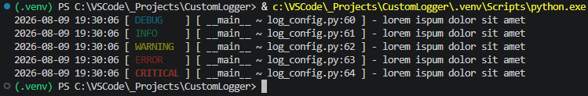
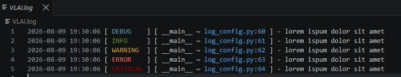

# CustomLogger

A lightweight Python logging package.  

[+] Custom ANSI color-coded console output.  
[+] Automatic rotating file handlers.  
[+] Zero external dependencies using Python's standard library.  

## Visual Showcase

### Console Output



### File Output



[+] log_space = 5mb * 3 files.  
[+] logs loop over olddest records.

## Installation

Install directly from GitHub into any project or virtual environment:

```bash
pip install git+https://github.com/Talon217/CustomLogger.git
```

## Quick Start

### core.py

```python
import logging
from custom_logger import setup_logger
from logic import Logic

# 1. Initialize custom logger ONCE at startup
setup_logger(console_level=logging.DEBUG) # Defaults: 'console_level=logging.WARNING, file_level=logging.DEBUG'

# 2. Local logger for main script
logger = logging.getLogger(__name__)

def main():
    logger.info("Application starting...")
    game = Logic()
    game.make_move(1, 1)

if __name__ == "__main__":
    main()
```

### logic.py

```python
import logging  # Standard built-in library ONLY (No setup_logger import!)

# Creating a logger named "logic"
logger = logging.getLogger(__name__)

class Logic:
    def __init__(self):
        logger.debug("Initializing Logic engine...")

    def make_move(self, row: int, col: int):
        logger.info(f"Move registered at row {row}, col {col}")
```

## FAQ

> For the time being, this module will remain static a static logger flavor.
> For more dynamic customization try importing: `logging` and `colorlog`.
